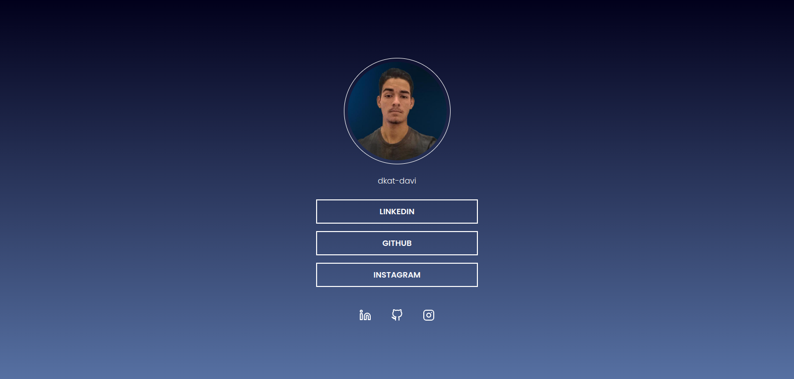

    <h1>Social Tree</h1>
    
Page with a list of links that can be used in social network profiles to direct the use to the chosen location

    </img>
    <a href="https://www.figma.com/file/yi1ycIyAW8QiGiX9bMFHkU/DD-%2F-Social-links/duplicate" target="_blank">
        <small>
project layout
</small>
    </a>

 

[)](https://www.linkedin.com/in/dkat-davi/)

      
    
<small><strong>Build with REACT</strong></small>

<footer align="right">
    <a href="https://efficient-sloth-d85.notion.site/Desafio-Social-Tree-a4008e467a3248c4b05c97cf78aea44f" target="_blank">
        <strong>Challenge from Rocketseat</strong>
    </a>
</footer>